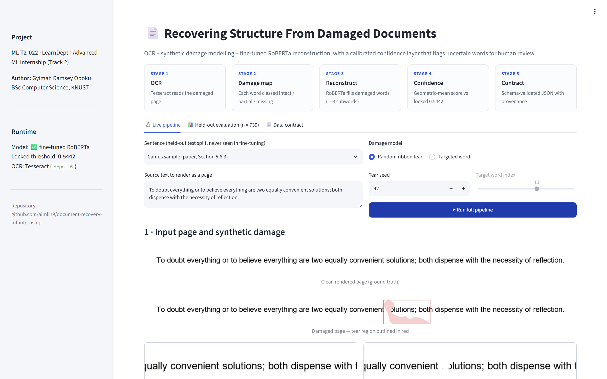
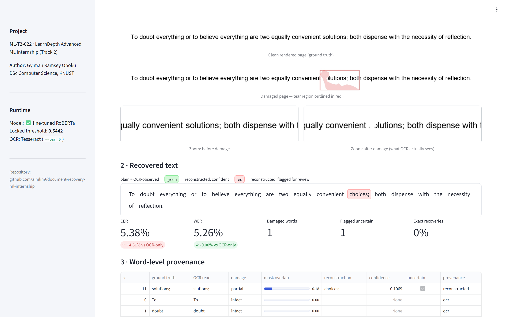
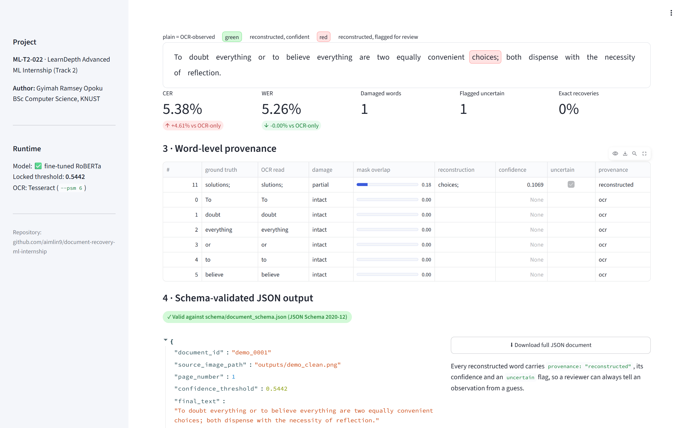
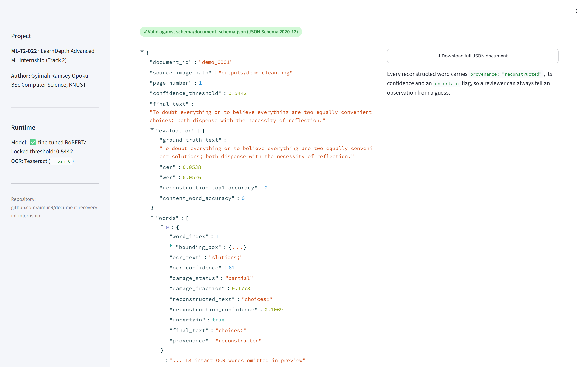
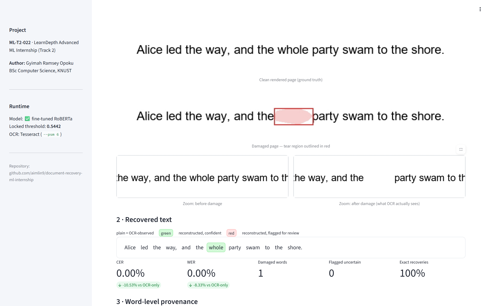
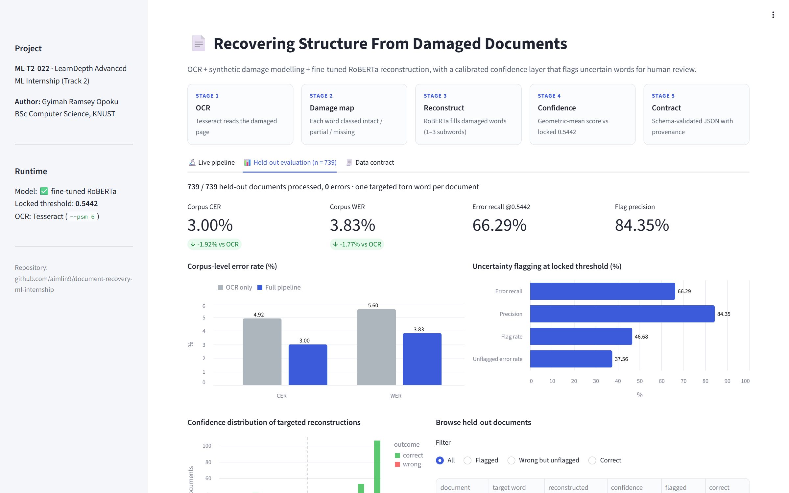
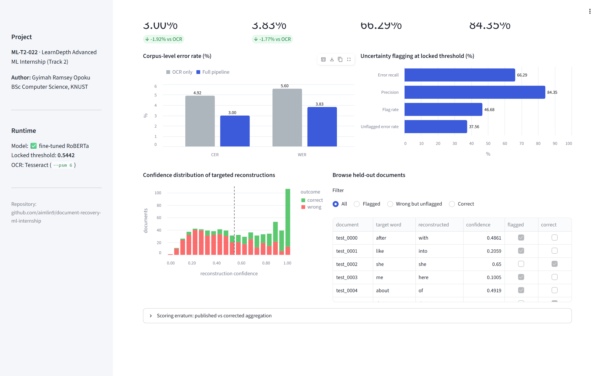
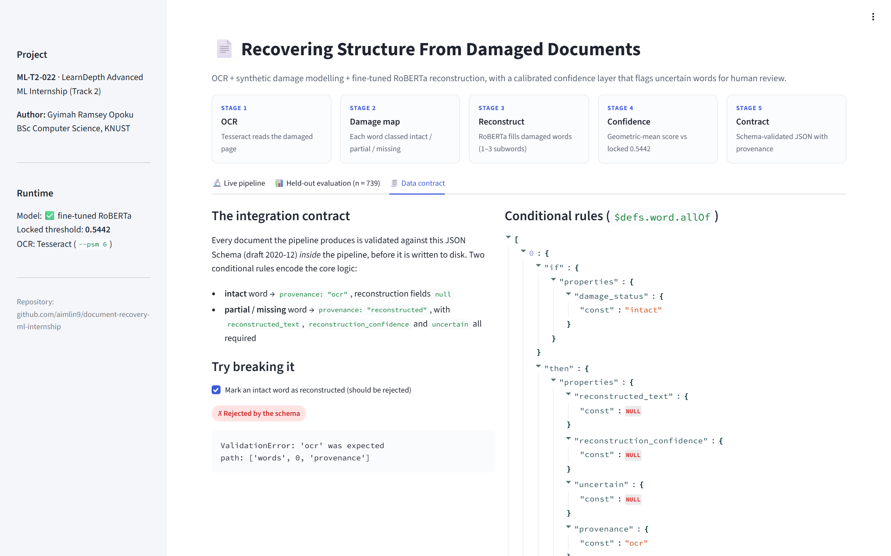

# Recovering Structure From Damaged or Poorly Scanned Documents

**An end-to-end pipeline combining OCR, synthetic damage modeling, and confidence-calibrated language-model reconstruction.**

LearnDepth™ Advanced Machine Learning Internship, Track 2 · Problem ID **ML-T2-022** · Learn Depth Academy LLP

| | |
|---|---|
| **Author** | Gyimah Ramsey Opoku |
| **Student ID** | LD-1787404180111 |
| **Programme** | BSc. Computer Science (Third Year) |
| **Department / College** | Department of Computational and Physical Sciences, College of Science |
| **Institution** | Kwame Nkrumah University of Science and Technology (KNUST), Kumasi, Ghana |
| **LinkedIn** | [linkedin.com/in/ramsey-opoku-gyimah-79a4b72aa](https://www.linkedin.com/in/ramsey-opoku-gyimah-79a4b72aa) |

---

## Submission deliverables

| Requirement | Where |
|---|---|
| **Technical paper** | [`docs/Technical_Paper_Document_Recovery_ML_Internship.pdf`](docs/Technical_Paper_Document_Recovery_ML_Internship.pdf) (41 pages, cover page + profile, abstract, methodology, results, appendices) |
| **Demo video** | [`docs/demo/demo_video.mp4`](docs/demo/demo_video.mp4) (2 min 13 s, captioned walkthrough of the live pipeline and the 739-document evaluation) |
| **Deployment** | Interactive Streamlit app ([`app.py`](app.py)), run locally with `streamlit run app.py` (see [Run the demo](#run-the-demo-app)) |
| **Final project screenshots** | [`docs/screenshots/`](docs/screenshots/) (8 screenshots, previewed below) |
| **Source code** | [`scripts/`](scripts/) (pipeline) · [`schema/`](schema/) (data contract) · [`results/`](results/) (evaluation outputs) |

## Overview

Standard OCR engines respond to torn or missing regions by silently emitting their best guess, with no signal that a word was never actually read. This project builds a pipeline that is honest about that:

1. **OCR:** Tesseract reads the (damaged) page image.
2. **Damage classification:** each word is classed *intact* (<5% of its box torn), *partial* (5–90%) or *missing* (>90%).
3. **Reconstruction:** a fine-tuned RoBERTa masked-language model fills in every damaged word, searching 1–3 subword tokens and rejecting candidates that span a word boundary.
4. **Confidence flagging:** each reconstruction gets a geometric-mean confidence score. Scores at or below the validation-locked threshold **0.5442** are flagged for human review.
5. **Data contract:** every page becomes one JSON document, validated inside the pipeline against [`schema/document_schema.json`](schema/document_schema.json) (JSON Schema 2020-12). Each word carries a `provenance` tag (`ocr` or `reconstructed`), so an observation can always be told apart from a guess.

## Key results: Step 5, full held-out set (n = 739 documents)

739 / 739 documents processed, 0 errors, every output schema-valid.

| Metric | OCR only | Full pipeline |
|---|---|---|
| Corpus-level CER | 4.92% | **3.00%** |
| Corpus-level WER | 5.60% | **3.83%** |

| Reconstruction and uncertainty flagging (locked threshold 0.5442) | As published in the paper | Corrected aggregation (current `results/`) |
|---|---|---|
| Top-1 reconstruction accuracy | 40.32% | 40.60% |
| Content-word accuracy | 28.02% (n = 521) | 28.27% (n = 527) |
| Error recall | 65.76% | 66.29% |
| Precision | 84.30% | 84.35% |
| Flag rate | 46.55% | 46.68% |
| Unflagged error rate | 38.23% | 37.56% |

**Erratum (scoring fix, September 2026).** The padded tear sometimes also clips a neighbouring word (41 of 739 documents). The original aggregation loop scored whichever damaged word came *last* in reading order, so in 17 documents it scored that neighbour instead of the targeted word. The fixed script scores the targeted word, as the methodology describes. Every OCR read, reconstruction and confidence value is unchanged: the full run was repeated and reproduced them exactly. Only the aggregate accuracy and flagging figures move, by at most 0.7 points. The paper's conclusions, including the generalization gap from the Step 4 text-only calibration (80.06% recall on validation), are unaffected. The originally published report is kept at [`results/held_out_summary_report_as_published.json`](results/held_out_summary_report_as_published.json) for traceability.

## Screenshots

| | |
|---|---|
|  **1.** App overview and the five pipeline stages |  **2.** Synthetic tear, zoomed damage and recovered text |
|  **3.** Per-page CER/WER and word-level provenance table |  **4.** Schema-validated JSON output with confidence and `uncertain` flag |
|  **5.** Held-out sentence with one word torn out, reconstructed correctly |  **6.** 739-document evaluation dashboard |
|  **7.** Confidence distribution vs threshold, and the document browser |  **8.** The data contract rejecting an invalid document |

## Setup

**Requirements:** Python 3.10+ and [Tesseract OCR](https://github.com/tesseract-ocr/tesseract).

```bash
git clone https://github.com/aimlin9/document-recovery-ml-internship.git
cd document-recovery-ml-internship
python -m venv venv
venv\Scripts\activate          # Windows  (macOS/Linux: source venv/bin/activate)
pip install -r requirements.txt
```

Tesseract is found automatically from the `TESSERACT_CMD` environment variable, then your `PATH`, then the default Windows location `C:\Program Files\Tesseract-OCR\tesseract.exe`.

### Fine-tuned model

The fine-tuned RoBERTa weights (~480 MB) are too large for GitHub and are hosted on Google Drive:

**https://drive.google.com/drive/folders/1gbYFTWuWN3otPWE4aoP2oH5NIM9QhaHm?usp=sharing**

Download the folder and place it at the project root as `roberta-finetuned-final/` (or set `ROBERTA_MODEL_PATH`). Without it, the pipeline still runs on plain `roberta-base`, but prints a loud warning: the 0.5442 threshold was calibrated for the fine-tuned model only.

## Run the demo app

```bash
streamlit run app.py
```

Then open http://localhost:8501. The app has three tabs:

- **Live pipeline:** pick a held-out sentence (or type your own), choose a random ribbon tear or a targeted word, and run the full pipeline. It shows the clean and damaged page, the recovered text colour-coded by provenance and confidence, a word-level table, and the downloadable schema-valid JSON.
- **Held-out evaluation:** metrics and charts for all 739 documents, the confidence distribution against the threshold, and a filterable document browser.
- **Data contract:** the schema's conditional rules, with a live "try breaking it" check.

## Reproduce the results

All commands are run from the project root:

```bash
python scripts/check_corpus.py                        # corpus SHA-256 + held-out count (739)
python scripts/build_document_json.py                 # single-page demo -> results/camus_sample_001_output.json
python scripts/run_held_out_evaluation.py --limit 20  # smoke test (writes *_smoke files only)
python scripts/run_held_out_evaluation.py             # full run, ~13-15 min on CPU
```

The full run writes `data/held_out_manifest.json` (corpus hash and count), `results/held_out_documents/test_0000.json` … `test_0738.json`, `results/held_out_results.jsonl` and `results/held_out_summary_report.json`. Intermediate images go to `held_out_temp_images/` and `outputs/`. They are regenerated deterministically and not tracked.

## Repository structure

```
app.py                     Streamlit demo (live pipeline + evaluation dashboard)
scripts/
  paths.py                 project-root paths + Tesseract discovery (shared by every script)
  baseline_ocr.py          Step 1: page rendering + OCR under synthetic degradation
  torn_regions.py          Step 2: ribbon-tear mask generation, background-matched fill
  word_targeted_masks.py   Step 2: word boxes + targeted tear masks
  reconstruction.py        Step 2/3: per-word damage classification, pretrained baseline
  build_corpus.py          corpus construction from Project Gutenberg
  build_masked_examples.py Step 4: masked-word fine-tuning examples
  build_document_json.py   Step 5: end-to-end stitching into one schema-valid JSON per page
  run_held_out_evaluation.py  Step 5: 739-document batch evaluation + aggregate report
  check_corpus.py          corpus hash / count verification
schema/document_schema.json   JSON Schema integration contract
data/                      sentence corpus, masked examples, held-out manifest
results/                   per-document JSON outputs, summary reports, sample output
docs/                      technical paper, stage/step results notes, screenshots, demo video
```

## Stage documents

1. Stage 1: Research Brief ([`docs/Stage1_Research_Brief.pdf`](docs/Stage1_Research_Brief.pdf))
2. Stage 2: Development Brief ([`docs/Stage2_Development_Brief.pdf`](docs/Stage2_Development_Brief.pdf))
3. Step 1: Baseline OCR under degradation ([`docs/Step1_Baseline_Results.pdf`](docs/Step1_Baseline_Results.pdf))
4. Step 2: Damage masking and classification ([`docs/Step2_Results_Note.pdf`](docs/Step2_Results_Note.pdf))
5. Step 3: Pretrained reconstruction baseline ([`docs/Step3_Results_Note.pdf`](docs/Step3_Results_Note.pdf))
6. Step 4: Fine-tuning and uncertainty tagging ([`docs/Step4_Results_Note.pdf`](docs/Step4_Results_Note.pdf), [`docs/Step4_Uncertainty_Tagging_Results_Note.pdf`](docs/Step4_Uncertainty_Tagging_Results_Note.pdf))
7. Step 5: End-to-end integration ([`docs/Step5_Integration_Results_Note.pdf`](docs/Step5_Integration_Results_Note.pdf))

## Final-submission fixes (September 2026)

- **Broken paths after the repo reorganisation.** The scripts still expected the corpus, schema and model in the current folder, so `run_held_out_evaluation.py`, `check_corpus.py` and `build_document_json.py` failed from a fresh clone. All paths now resolve from the project root via `scripts/paths.py`.
- **Crash in `build_document_json.py`.** Leftover debug prints indexed words 17 and 18 directly, raising `IndexError` on any page with fewer than 19 words. They have been removed, and the output is now validated *before* it is written to disk.
- **Evaluation scoring bug.** The wrong word was scored in 17 documents (see the erratum above).
- **Portability.** The Tesseract path is no longer hardcoded to Windows, there is a font fallback for machines without Arial, and output JSON uses project-relative `source_image_path` values.
- **`requirements.txt`** was saved as UTF-16 and listed the whole dependency tree. It is now plain UTF-8 with the direct dependencies pinned to the versions that produced the results.
- **Housekeeping.** Stray duplicate scripts and outputs were removed from the root, and the shared OCR/record-building code is factored out so the batch evaluation, CLI and demo app run the same code path.

## Scope and limitations

Damage location is **known, not detected**: word damage is computed against a synthetic mask the pipeline created itself, which is a benchmarking convenience, not a real damage detector. Reconstruction is one word at a time. The confidence threshold was calibrated on text-only data and transfers only partially to image-based conditions. See Sections 9–11 of the technical paper for the full discussion and future work.
